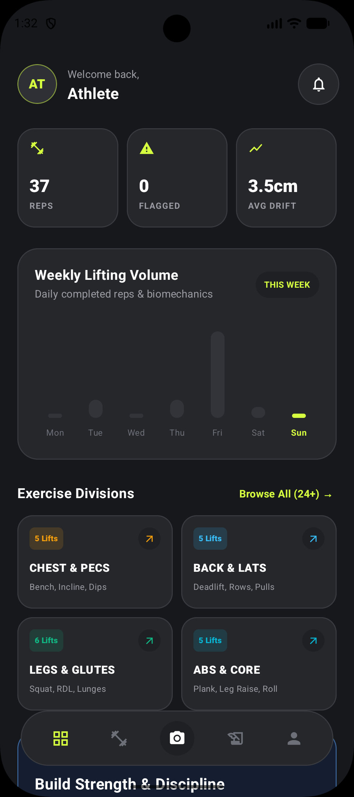
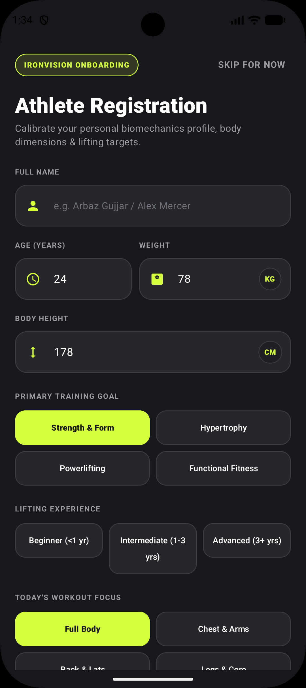
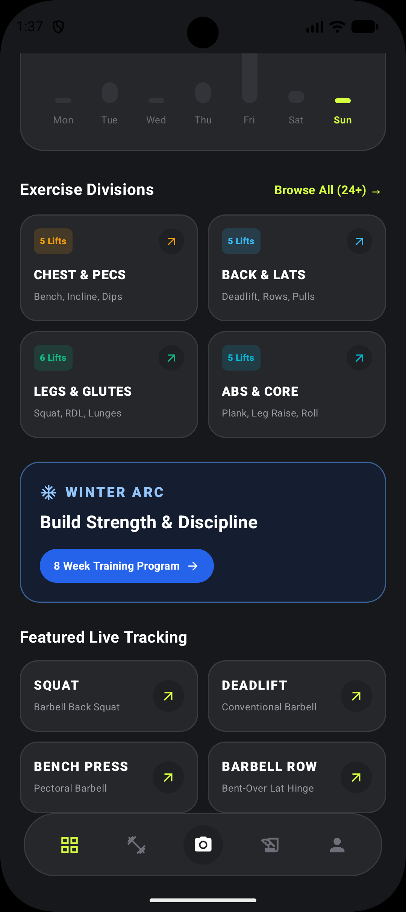
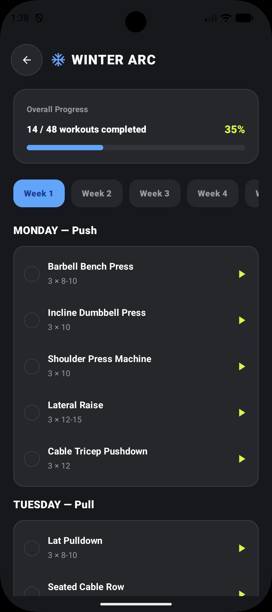
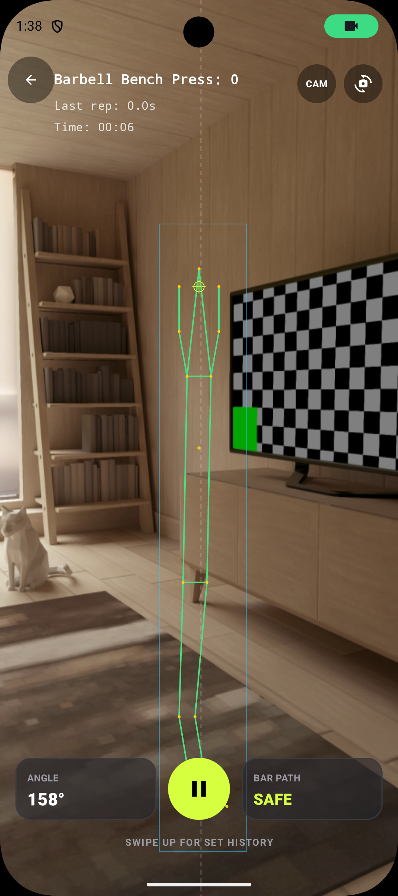
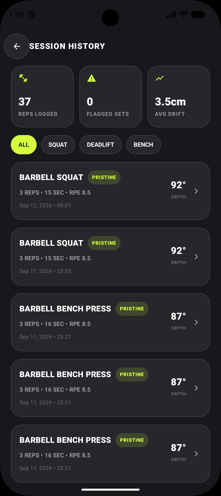
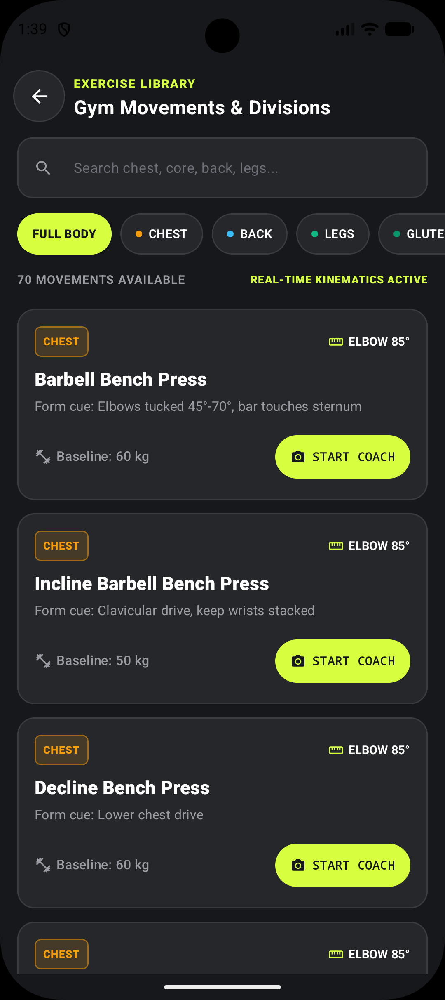
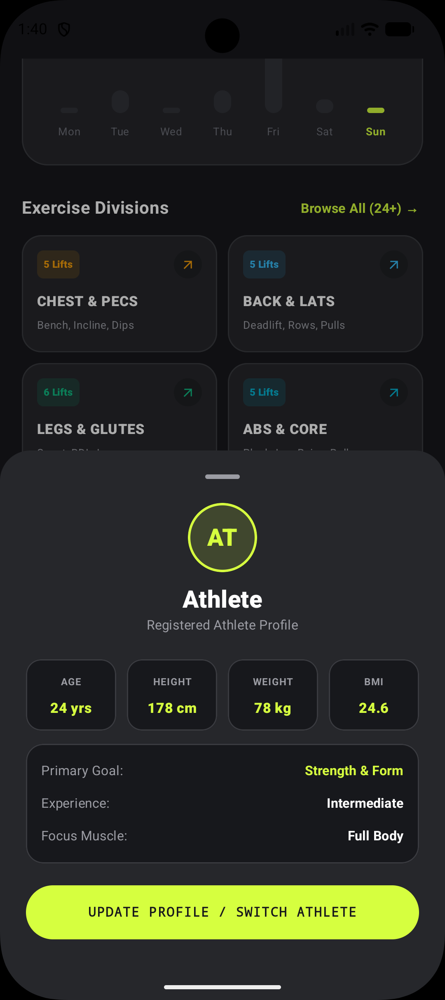
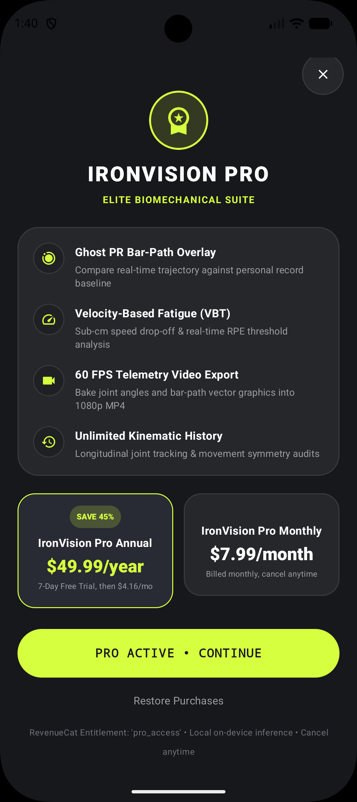
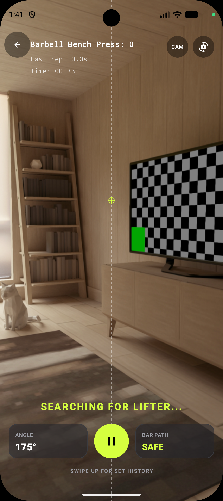

# IronVision

**A 100% on-device AI biomechanics and lifting coach for Android.**

Real-time skeletal tracking, joint angle analysis, automatic rep counting, and bar-path drift detection — all running locally on your phone, no internet required.

Built for RevenueCat Shipaton 2026 (Next Gen Award — Student Track).

---

## Screenshots

| Dashboard | Athlete Onboarding | Exercise Divisions |
|---|---|---|
|  |  |  |

| Winter Arc Program | Live Tracking | Session History |
|---|---|---|
|  |  |  |

| Exercise Library | Athlete Profile | Pro Paywall |
|---|---|---|
|  |  |  |

<p align="center">
  
</p>

## Features

- **Live camera tracking** — offline skeletal extraction via Google ML Kit (BlazePose), 30+ fps
- **Automatic rep counting** — a five-state rep state machine (Idle → Eccentric → Inflection → Concentric → Lockout)
- **Bar path / medial drift detection** — flags horizontal barbell drift over ~4.5cm from vertical, shown live as SAFE / warning in-session
- **Winter Arc** — a built-in 8-week Push/Pull/Legs program with adherence and progress tracking
- **Exercise Library** — 70+ movements across Chest, Back, Legs, Glutes and more, each with form cues and target joint angles
- **Session History** — rep-by-rep logs with depth, RPE, and form-quality tags (e.g. "Pristine")
- **Athlete Profile** — stores body stats, training goal, and experience level to calibrate coaching
- **IronVision Pro** — Ghost PR bar-path overlay, velocity-based fatigue tracking, 60fps telemetry video export, and unlimited kinematic history
- **Privacy by design** — no video, image, or pose data ever leaves the device

## Tech stack

Kotlin · Jetpack Compose (Material 3) · CameraX + MlKitAnalyzer · Google ML Kit (BlazePose, bundled accurate model) · Room + KSP · WorkManager · RevenueCat · R8 full-mode obfuscation

## Architecture

The core logic lives in `BiomechanicsEngine.kt`, which converts raw (x, y) pose landmarks into joint angles using vector dot-product math, then drives the rep state machine and bar-path drift detection shown above.

## Getting started

```bash
git clone https://github.com/YOUR_USERNAME/ironvision.git
cd ironvision
# open in Android Studio and run on a device with a camera
```

## Monetization

IronVision uses the RevenueCat SDK to gate **IronVision Pro** (Ghost PR overlay, velocity-based fatigue analysis, 60fps telemetry export, unlimited kinematic history) behind a subscription — $7.99/month or $49.99/year with a 7-day free trial — while live tracking, rep counting, and the exercise library stay free.


